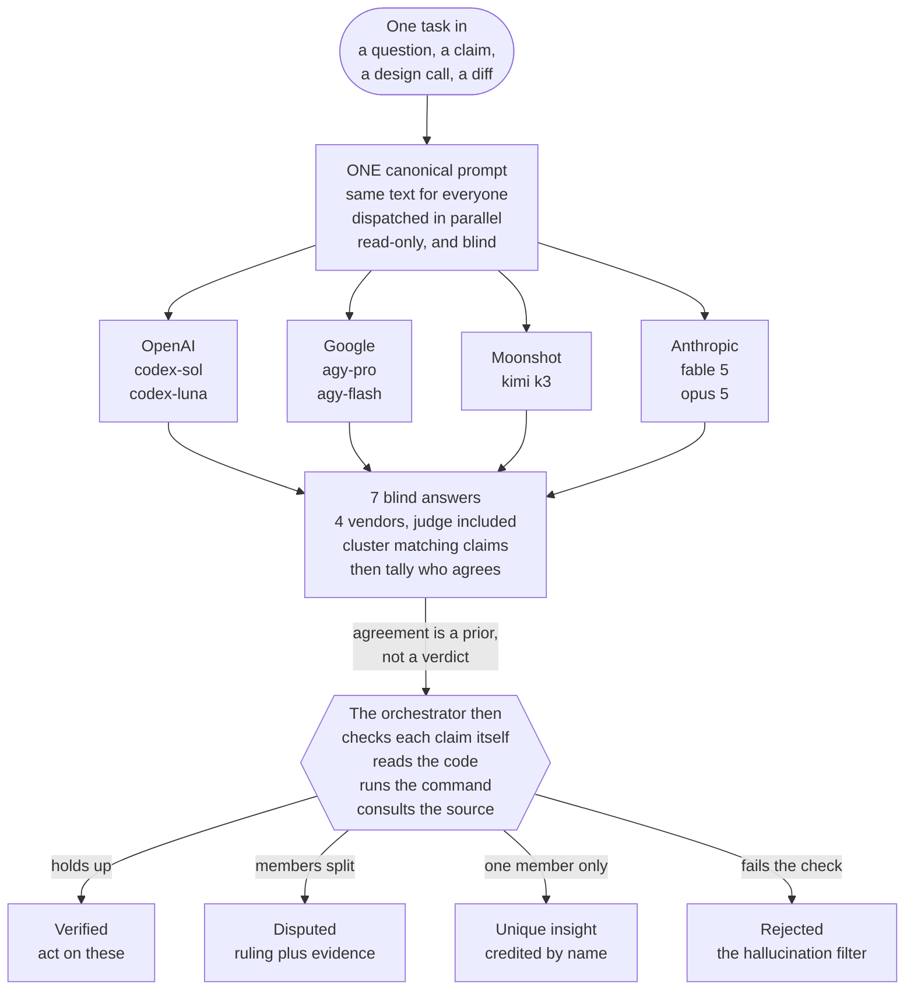

# LLM Ensemble

A Claude Code skill that asks **seven frontier models the same question at the same time**, keeps them blind to each other, and then verifies what they said before reporting it.

The point isn't a vote. It's that a claim only reaches the final report after someone *checked* it — so a confident hallucination from one model gets caught by the others' silence, and a confident hallucination from *all* of them gets caught by the orchestrator reading the actual code.



## Using it

Inside Claude Code, just ask — the skill triggers on second-opinion phrasing:

```
/llm-ensemble Is this migration plan safe to run on a live table?
review my working diff with the ensemble
get a cross-model consensus on whether this cache can leak memory
```

Scope the roster inline when you want to: *"only sol, agy-pro and kimi"*, *"add cursor"*, *"use k3-256k"* — each `(CLI, model)` pair is its own member, and the bench of verified alternates is in [`roster.md`](roster.md).

## The default roster

| Member | Model | Vendor | Dispatch |
|---|---|---|---|
| `codex-sol` | `gpt-5.6-sol` @ max effort | OpenAI | `codex exec` CLI |
| `codex-luna` | `gpt-5.6-luna` | OpenAI | `codex exec` CLI |
| `agy-pro` | `gemini-3.1-pro-high` | Google | `agy` (Antigravity) CLI |
| `agy-flash` | `gemini-3.6-flash-high` | Google | `agy` (Antigravity) CLI |
| `kimi` | `k3` | Moonshot | `kimi` CLI |
| `fable` | `claude-fable-5` | Anthropic | native — no CLI |
| `opus` | `claude-opus-5` | Anthropic | native — no CLI |

Seven members, four independent lineages. The Claude voices need no CLI because the skill runs inside Claude Code: one of them is the orchestrator's own answer, the other is a subagent with a model override.

## Why it's built this way

**One prompt, verbatim.** Every member gets byte-identical input. Tailoring per member would mean disagreement could come from the prompts rather than the models — which would quietly destroy the only signal the ensemble produces.

**Blind, and it has to stay blind.** No member sees another's answer, including through the back door: fast members finish while slow ones are still thinking, so member working directories are kept away from the directory answers land in. The orchestrator commits its own answer to disk *before* reading anyone else's.

**Verification outranks the vote.** Agreement is evidence about the models, not about the world — they share training data and can be confidently wrong together. Every load-bearing claim gets checked directly (read the code, run the command, consult the doc) before it's labeled Verified. Unique claims are the most valuable *or* the most hallucinated, so they're never promoted or discarded on the vote alone.

**Members are counted, vendors are weighted.** Three vendors field two members each, so a raw 5/7 can hide a two-vendor echo. Verdicts that hinge on the count report both tallies. And when a vendor splits against *itself* — sol vs luna, or fable vs opus — that's treated as a signal that the question is genuinely underdetermined rather than a tie to break.

**It says when not to bother.** A grep, a doc lookup, or running the test beats seven opinions. The skill is instructed to say so rather than spend seven quotas confirming something checkable.

## What you get back

A report with a consensus map (one row per claim, one column per member), then: agreed-and-verified findings to act on, disputed claims with the adjudicating evidence, verified unique catches credited to the member that found them, and a **Rejected** section — claims that failed verification, which is the hallucination filter doing its job in the open. Dead or timed-out members are always listed, never silently dropped.

## Setup

Only the two Anthropic voices are required; everything else degrades gracefully — with no external CLIs the skill says so, answers anyway, and prints the setup steps.

| CLI | Install | Auth |
|---|---|---|
| `codex` | OpenAI Codex CLI | `codex login` |
| `agy` | `brew install --cask antigravity-cli` | Antigravity account |
| `kimi` | Moonshot kimi-code | `kimi login` |
| `cursor-agent` (opt-in) | Cursor | `cursor-agent login` |

Per-CLI command templates, read-only flags, model IDs, known-blocked models, and re-verification instructions live in [`roster.md`](roster.md) — that's the file to update after a CLI upgrade. The procedure itself is in [`SKILL.md`](SKILL.md).

Every member runs **read-only**: sandbox or plan mode on each CLI, never a yolo/force/bypass flag, and Claude subagents are instructed not to write. An ensemble run cannot modify your repo.
